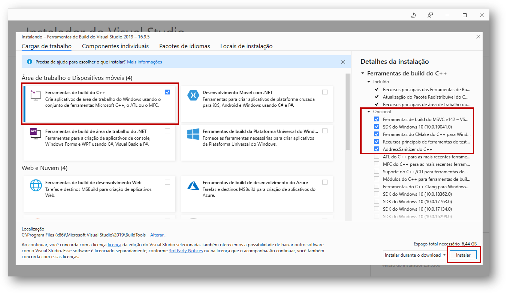
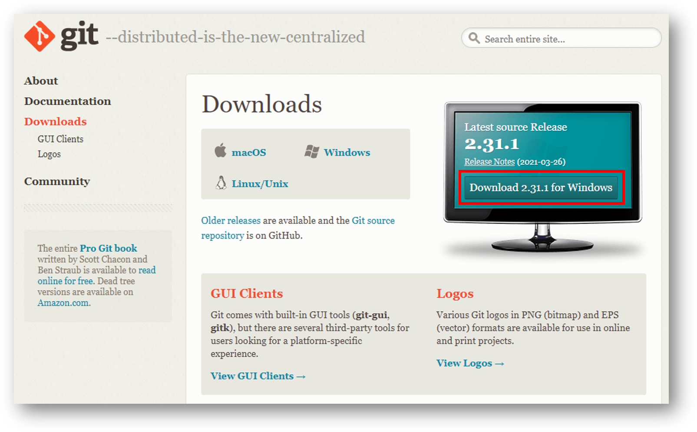
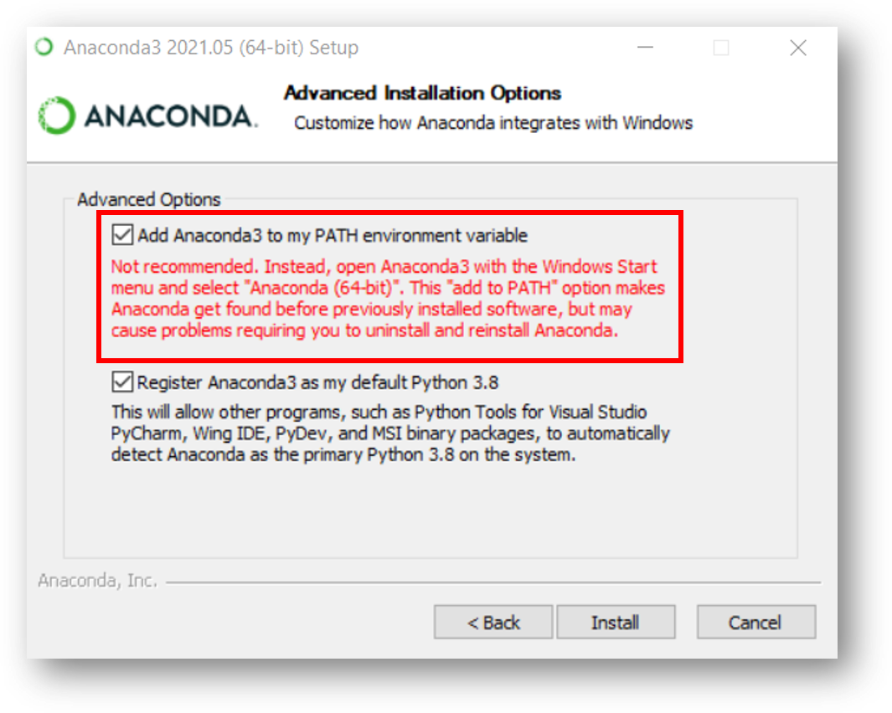
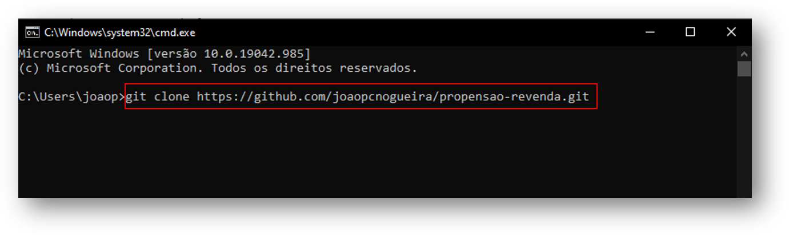
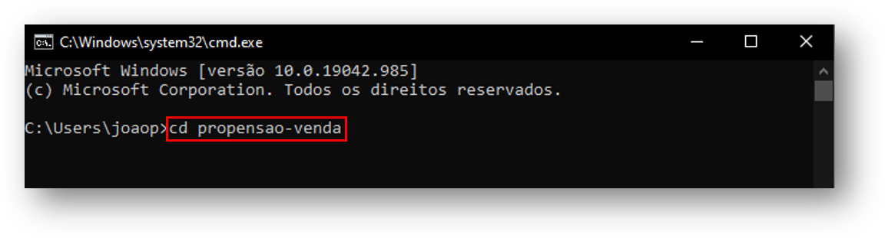
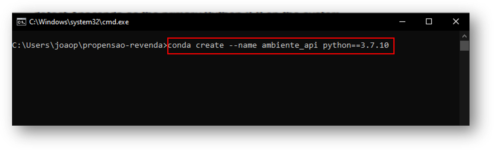
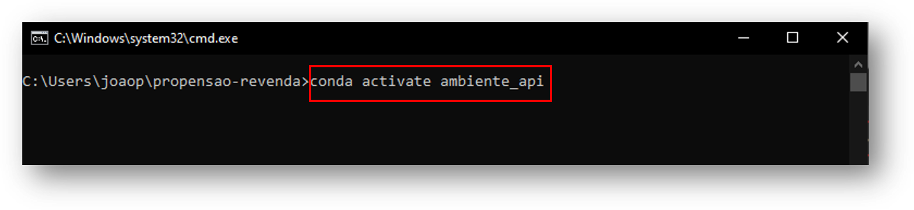
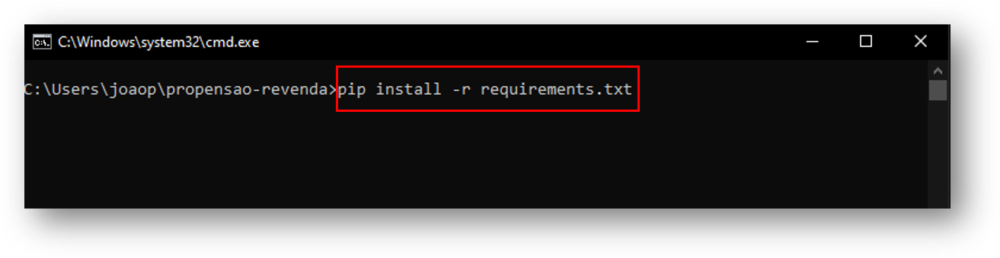

# Tutorial deploy no Windows 10 com Anaconda
## 1. Pré-requisitos

### 1.1 Instale o Microsoft Visual C++

* Link para o download: https://visualstudio.microsoft.com/pt-br/thank-you-downloading-visual-studio/?sku=BuildTools&rel=16

Execute o arquivo baixado e clique em Ferramentas de Build do C++ e depois em Instalar, conforme imagem abaixo.



Esse processo irá demorar um pouco (~ 10 minutos). Faça um :coffee: ​e aproveite :)

Quando terminar, feche o instalador e continue com os próximo tópicos.


### 1.2 Instale o Git
* Link para download: https://git-scm.com/downloads



### 1.3 Instale o Anaconda
* Link para download: https://www.anaconda.com/products/individual

No momento da instalação, selecionar a seguinte opção: `Add Anaconda3 to my PATH environment variable`



## 2. Configuração

### 2.1 Faça o clone do código fonte
Abra o `CMD` e digite o seguinte comando para baixar o código

```
git clone https://github.com/joaopcnogueira/propensao-revenda.git
```



Depois de finalizado, digite o comando `dir` e verifique que uma pasta chamada `propensao-revenda` ou `propensao-revenda-main` agora existe no seu computador.
Essa pasta contém todo o código fonte da nossa aplicação. Navegue até a pasta digitando o seguinte comando no `CMD`

```
cd propensao-venda
```

ou 

```
cd propensao-venda-main
```



### 2.2 Crie um ambiente python com Anaconda

```
conda create --name ambiente_api python==3.7.10
```



### 2.3 Ative o ambiente python criado no passo anterior

```
conda activate ambiente_api
```



### 2.4 Instale os pacotes necessários

```
pip install -r requirements.txt
```

Caso o comando acima não funciona, executar o comando abaixo:

```
pip install --user -r requirements.txt
```



## 3. Iniciando e testando o deploy
### 3.1 Inicie o serviço da API

```
uvicorn api:app --reload
```

### 3.2 Testando a API
Abra o seguinte caminho no seu navegador:
* `http://127.0.0.1:8000/docs`
* Clique no endpoint `/predict` e depois em `Try it out` 
* Só preencher os valores desejados das features e clicar em `Execute` 

### 3.3 Testando o Web App
Abra um novo `CMD`, acesso o diretório dos códigos e ative o ambiente virtual criado anteriormente. Para realizar os passos, execute os comandos abaixo:

```
conda activate ambiente_api
```

```
streamlit run web_app.py
```

Se for a primeira execução, o Streamlit irá solicitar algumas informações. Pode deixar em branco, apenas aperte Enter.

Dê a permissão necessária, caso o Firewall bloqueie (basta clicar em Permitir Acesso, caso uma janela apareça).

Por fim, abra o navegador e digite a URL: `http://127.0.0.1:8501`.
