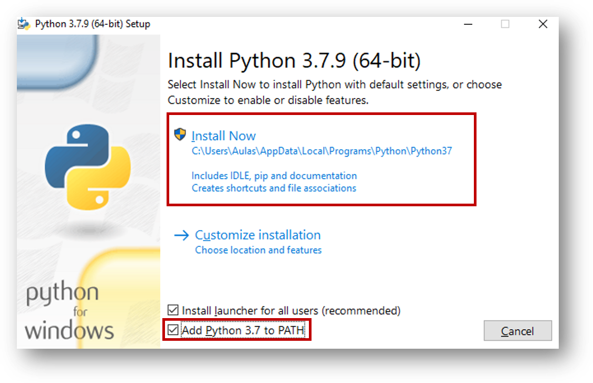
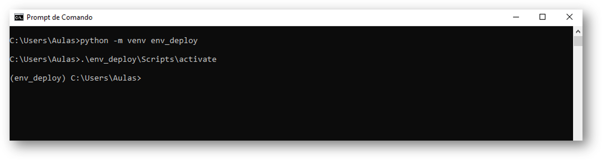

# Tutorial deploy no Windows 10 com Python
### 1. Pré-requisitos

#### 1.1. Instale o Microsoft Visual C++

* Link para o download: https://visualstudio.microsoft.com/pt-br/thank-you-downloading-visual-studio/?sku=BuildTools&rel=16

Execute o arquivo baixado e clique em Ferramentas de Build do C++ e depois em Instalar, conforme imagem abaixo.


Esse processo irá demorar um pouco. Faça um :coffee: ​e aproveite :)

Quando terminar, feche o instalador e continue com os próximo tópicos.


#### 1.2. Instale o Git

* Link para download: https://git-scm.com/downloads


#### 1.3. Instale o Python 3.7.9

* Link para download: https://www.python.org/downloads/release/python-379/
* Link para download direto para Windows 64 bits: https://www.python.org/ftp/python/3.7.9/python-3.7.9-amd64.exe

**ATENÇÂO** No momento da instalação do Python marque a opção *Add Python 3.7.9 to PATH*, conforme imagem abaixo.





### 2. Configuração

#### 2.1 Crie um ambiente virtual

Abra o `CMD` e digite o seguinte comando para criar o ambiente virtual na pasta raiz do usuário (por exemplo: `C:\Users\Aulas>`).


```
python -m venv env_deploy
```

#### 2.2 Ative o ambiente virtual

Ainda no `CMD` digite o comando abaixo para ativar o ambiente virtual criado.

```
.\env_deploy\Scripts\activate
```

Note que o texto `(env_deploy)` estará a esquerda de `C:\Users\Aulas>`. Conforme imagem abaixo.




#### 2.3. Faça o clone do repositório

Abra o `CMD` e digite o seguinte comando para baixar o código

```
git clone https://github.com/joaopcnogueira/propensao-revenda.git  propensao-revenda
```

Depois de finalizado, digite o comando `dir` e verifique que uma pasta chamada `propensao-revenda` foi adicionado no diretório raiz (`C:\Users\Aulas>`).

Essa pasta contém todo o código fonte da nossa aplicação. Navegue até a pasta digitando o seguinte comando no `CMD`

```
cd propensao-revenda
```

#### 2.4. Instale os pacotes necessários


```
pip install pip setuptools -U
```

Caso dê alguma mensamge de erro, execute o comando acima novamente. Por fim, execute o comando abaixo para realizar a instalação das bibliotecas necessárias:


```
pip install -r requirements.txt
```


### 3. Iniciando e testando o deploy

#### 3.1 Inicie o serviço da API

```
uvicorn api:app --reload
```


#### 3.2 Testando a API

Abra o seguinte caminho no seu navegador:

* `http://127.0.0.1:8000/docs`
* Clique no endpoint `/predict` e depois em `Try it out` 
* Só preencher os valores desejados das features e clicar em `Execute` 


#### 3.3 Testando o Web App

Abra um novo `CMD`, acesse o diretório dos códigos e ative o ambiente virtual criado anteriormente. Para realizar esses passos execute na sequencia os comandos abaixo:


```
.\env_deploy\Scripts\activate.\
```


```
cd propensao-revenda
```


```
streamlit run web_app.py
```

Se for a primeira execução, o Streamlit irá solicitar algumas informações, pode deixar em branco, apenas aperte Enter.

Dê a permissão necessária, caso o Firewall bloqueie (basta clicar em Permitir Acesso, caso uma janela apareça)


Por fim, abra o navegador e digite a URL: `http://127.0.0.1:8501`

